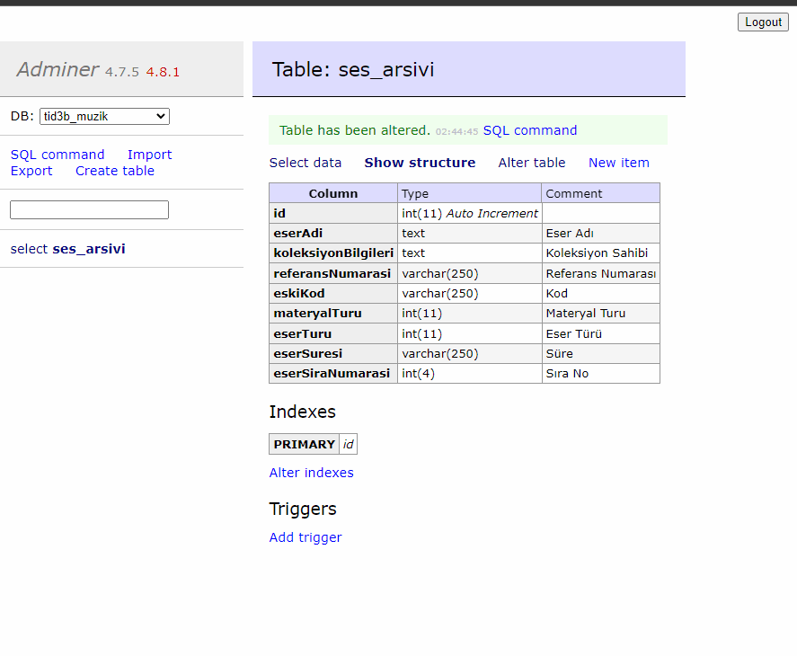

# phpFormOlustur
Veritabanına göre form oluşturan php scripti
medoo dosyasında veritabanı bilgilerinizi girin. Sayfayı açtığınızda veritabanı seçmenizi isteyen bir form gelecek. Veritabanını seçin ardından istediğiniz tabloyu seçin. Ekrana tablonun alanları gelecektir. Bu alanlardan formda kullanmak istediklerini seçin ve göster diyerek kodları kopyalayın.

Kodların içinde php insert komutları da vardır. Oluşturulen form bootstrap uyumludur.

 
